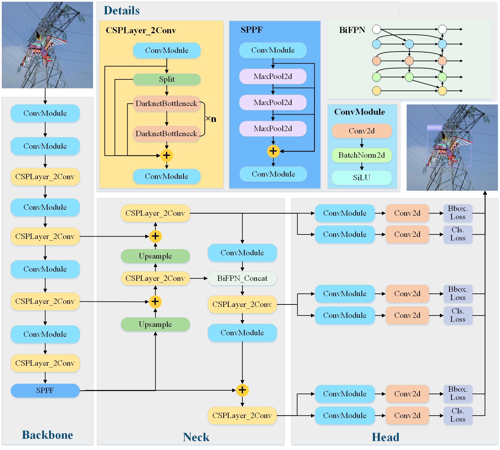
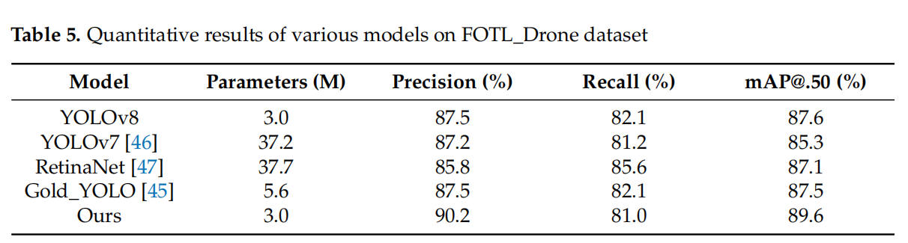

# YOLOv8_BiFPN

This repository contains the implementation of the paper titled "An End-to-End Foreign Object Detection on Transmission Lines from Drone-view Images." The project integrates YOLOv8 with a Bidirectional Feature Pyramid Network (BiFPN) to enhance the detection of foreign objects on power transmission lines from drone-view images.

## Overview

Foreign objects such as nests often lead to widespread power outages. Detecting foreign objects on transmission lines is crucial, but manual detection is time-consuming and labor-intensive. This project aims to provide an automated, efficient solution using advanced deep learning techniques.

Here is the architecture of our YOLOv8-BiFPN:



## Features

- **YOLOv8_BiFPN**: An enhanced version of YOLOv8 with Bidirectional Feature Pyramid Network for improved multi-scale feature fusion.
- **FOTL_Drone Dataset**: A comprehensive dataset containing 1,495 annotated images of 6 types of foreign objects on transmission lines, captured from drone perspectives.

## Results

Our proposed YOLOv8_BiFPN model achieves:
- Average Precision (AP): 90.2%
- Mean Average Precision (mAP@.50): 0.896

Here is the comparision with other networks:




Here is the detection result of our YOLOv8-BiFPN:


## Installation

### Prerequisites

- Python 3.8+
- PyTorch 2.0
- CUDA 11.8 (for GPU support)
- Other dependencies listed in `requirements.txt`

### Steps

1. **Clone the repository**:
   ```sh
   git clone https://github.com/Changping-Li/YOLOv8_BiFPN.git
   cd YOLOv8_BiFPN
   ```

2. **Install dependencies**:
   ```sh
   pip install -r requirements.txt
   ```

3. **Prepare the dataset**:
   Download and place the FOTL_Drone dataset in the `ultralytics/yolo/data/` directory.

## Usage

### Training

To train the YOLOv8_BiFPN model:
```sh
python ultralytics/yolo/v8/detect/train.py --config ultralytics/models/v8/yolov8-BiFPN-final.yaml
```

### Evaluation

To evaluate the model:
```sh
python ultralytics/yolo/v8/detect/predict.py 
```

## File Structure

The core code directory of YOLOv8 contains all the code that implements the model's functionality.

### 1 ultralytics/assets

    Contains the project's static resources, such as images, pre-trained model files, etc. These resources are used for testing, documentation, or software examples.

### 2 ultralytics/yolo/cfg

    Stores configuration files that define the model's structure, training parameters, etc.

2.1 ultralytics/yolo/cfg/init.py
    
    The initialization file of the Python package, used to mark the current directory as part of the Python package. This allows the package's modules to be referenced by external code.

2.2 ultralytics/yolo/cfg/default.yaml

    This is a YAML configuration file containing the default configuration settings for YOLOv8. These settings include training parameters, model options, data processing methods, etc.

### 3 ultralytics/datasets
    
    This folder contains configuration files related to different datasets. These configuration files define how to load and preprocess datasets, the structure and attributes of the datasets, etc.

### 4 ultralytics/yolo/data
    
    Contains scripts and files related to data processing, such as dataset configuration files or data preprocessing code. This is crucial for model training and testing.

### 5 ultralytics/engine
        
    Contains the core functionality code of YOLOv8, such as model training, validation, and inference.

5.1 ultralytics/engine/init.py
    
    The initialization file of the Python package, used to mark the engine directory as a Python module.

5.2 ultralytics/engine/exporter.py
    
    Code responsible for exporting the model. This includes functionality for exporting the trained model to different formats (e.g., ONNX, TensorFlow, TorchScript, etc.).

5.3 ultralytics/engine/model.py
    
    Contains code for model construction and management. This involves defining the model architecture, loading model parameters, performing model inference, etc.

5.4 ultralytics/engine/predictor.py

    Implements model prediction functionality. This includes processing input data, performing model inference, returning prediction results, etc.

5.5 ultralytics/engine/results.py
    
    Used to handle and display model prediction results. This involves calculating performance metrics, generating result reports, etc.

5.6 ultralytics/engine/trainer.py

    Code responsible for model training. This includes setting up the training loop, optimizers, loss functions, etc.

5.7 ultralytics/engine/validator.py

    Implements model validation functionality. This includes running the model on the validation set, calculating and reporting performance metrics, etc.

### 6 ultralytics/hub
    
    Code integrated with PyTorch Hub, allowing users to easily download and use YOLOv8 models. This includes helper scripts for model loading and execution.

### 7 ultralytics/nn
        
    Contains code for neural network components, such as custom layers, activation functions, etc.

### 8 ultralytics/tracker
        
    Contains code related to object tracking. This supports tracking detected objects in videos or real-time streams.

### 9 ultralytics/yolo/utils
    
    Contains various utilities and helper functions, such as image processing, performance metric calculations, etc.

9.1 ultralytics/yolo/utils/callbacks
    
    Contains callback functions used during the training process. These functions are called at specific points during model training to log information such as training loss and learning rate.

9.2 ultralytics/yolo/utils/init.py
        
    The initialization file of the utils directory, marking it as a Python module.

9.3 ultralytics/yolo/utils/autobatch.py
        
    Contains functionality for automatic batch processing, optimizing efficiency when handling large amounts of data.

9.4 ultralytics/yolo/utils/benchmarks.py
        
    Contains functions for performance benchmarking, used to evaluate the model's speed and efficiency.

9.5 ultralytics/yolo/utils/checks.py
        
    Provides functions for checking and validating data or model status.

9.6 ultralytics/yolo/utils/dist.py
        
    Contains functionality related to distributed training, such as solving a bug in Python argparse during Distributed Data Parallel (DDP) training.

9.7 ultralytics/yolo/utils/downloads.py
        
    Contains functions related to downloading, such as downloading pre-trained models or other resources.

9.8 ultralytics/yolo/utils/errors.py
        
    Defines custom errors and exception handling functions.

9.9 ultralytics/yolo/utils/files.py
        
    Contains functions related to file operations, such as reading and writing files.

9.10 ultralytics/yolo/utils/instance.py
        
    Contains functions related to instances (objects), used for handling operations on a single model instance.

9.11 ultralytics/yolo/utils/loss.py
        
    Contains definitions and implementations of loss functions, which are crucial for the training process.

9.12 ultralytics/yolo/utils/metrics.py
    
    Contains functions for calculating and reporting performance metrics.

9.13 ultralytics/yolo/utils/ops.py
        
    Contains various operations and functions.

9.14 ultralytics/yolo/utils/patches.py
        
    Contains code patches related to fixing or improving existing functionality.

9.15 ultralytics/yolo/utils/plotting.py
        
    Provides data visualization functions, such as plotting graphs.

9.16 ultralytics/yolo/utils/tal.py
        
    Contains tools and functions for specific application logic.

9.17 ultralytics/yolo/utils/torch_utils.py
        
    Contains helper functions related to the PyTorch framework.

9.18 ultralytics/yolo/utils/triton.py
        
    Contains functionality for integrating with NVIDIA Triton inference server.

9.19 ultralytics/yolo/utils/tuner.py
        
    Provides functionality for model tuning and hyperparameter search.

### 10 ultralytics/init.py
    The initialization file of the Python package, marking the current directory as part of the Python package.

These directories and files collectively form the foundation of YOLOv8-BiFPN, from data processing and model configuration to the actual training and inference engine, as well as utility tools and advanced functionalities. Each component plays a crucial role in the overall functionality and performance of the framework.


## Methodology

### YOLOv8_BiFPN Architecture

In the task of using drones to detect foreign objects on transmission lines, there are often complex and variable environmental conditions such as weather, lighting, and background interference. The linear structure of power lines and the diversity of foreign objects increase the difficulty of detection.

**Bidirectional Feature Pyramid Network (BiFPN)**: 
- Enhances the performance of target detection by introducing a BiFPN structure into the detection head of YOLOv8.
- BiFPN is integrated during the process of connecting three layers of the network to form the detection head.
- This structure enhances multi-scale feature fusion and bidirectional information transmission, allowing the network to adapt better to complex environmental conditions and diverse target morphologies.

**Loss Functions**:
- **Classification Loss**: Binary Cross-Entropy (BCE) is employed as the classification loss.
- **Regression Loss**: The regression branch employs Distribution Focal Loss (DFL) and CIoU Loss for bounding box optimization.


## Dataset

**FOTL_Drone**:
- A dataset of foreign objects on transmission lines from drone perspective.
- Comprises a total of 1,495 annotated images, capturing six types of foreign objects (nest, kite, balloon, fire, person, monkey).
- Images sourced from Google, Bing, Baidu, Sogou, YouTube, Bilibili, and drone inspections.
- Annotations saved in XML format following the PASCAL VOC standard, supporting YOLO format.
- Split into training (1,196 images) and testing (299 images) sets.

Here is the example image of our dataset:


## Contribution

We welcome contributions from the community. Please feel free to submit pull requests or open issues for any bugs or feature requests.

## Acknowledgments

This work is supported by various grants and institutions, including the Basic Research Programs of Taicang, the Guangdong Key Laboratory of Intelligent Information Processing, and the National Natural Science Foundation of China.
